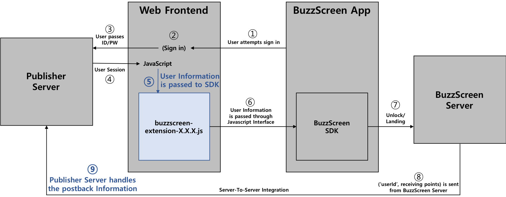
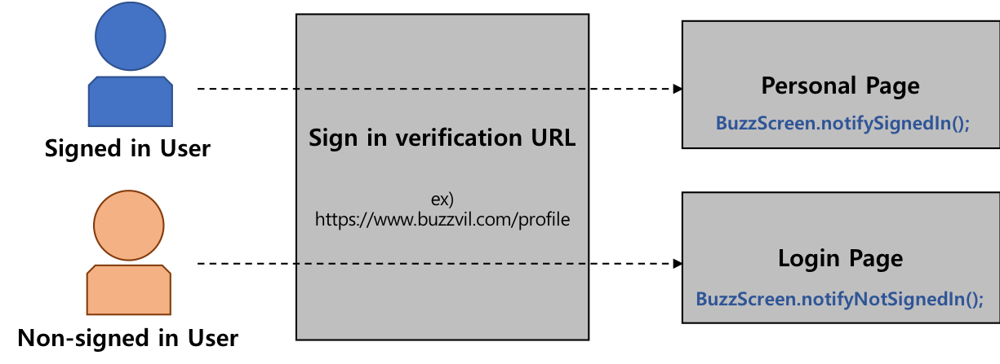

# BuzzScreen Extension JS SDK 가이드
> [English Version Link](README.md)

* 개인화된 콘텐츠와 광고를 안드로이드 잠금화면에서 보여주는 [버즈스크린](https://github.com/Buzzvil/buzzscreen-sdk-publisher)의 동작을 돕는 익스텐션 SDK입니다.
* 버즈스크린의 개인화를 위해서는 유저 정보가 필요하며, 퍼블리셔의 웹사이트에서 버즈스크린으로 유저 정보를 전달하기 위해서 이 SDK를 사용합니다.
* 이 가이드는 퍼블리셔의 사이트에 이 SDK를 어떻게 적용할 수 있는지 설명합니다.

## 로그인 및 포인트 적립 요청 흐름


1. 사용자는 버즈스크린 안드로이드 클라이언트에서 로그인 버튼을 눌러서 로그인을 시도합니다. 이 때, 안드로이드 앱은 [WebView](https://developer.android.com/reference/android/webkit/WebView.html)를 통해서 퍼블리셔의 웹 프론트엔드 사이트를 열어서 사용자에게 보여줍니다.
2. 사용자는 [WebView](https://developer.android.com/reference/android/webkit/WebView.html) 상에 보이는 퍼블리셔의 웹 프론트엔드에서 로그인을 시도합니다.
3. 퍼블리셔의 웹 프론트엔드는 사용자의 로그인을 위한 정보를 받아서 퍼블리셔의 서버로 전달합니다.
4. 퍼블리셔의 서버는 로그인이 성공한 유저의 세션 정보를 웹 프론트엔드에 전달합니다.
5. (퍼블리셔의 할 일) 퍼블리셔의 웹 프론트엔드는 사용자가 로그인된 것을 확인하고, BuzzScreen Extension JS SDK의 함수를 호출하여 유저 정보를 전달합니다.
6. BuzzScreen Extension JS SDK는 안드로이드에서 제공하는 [Javascript Interface](https://developer.android.com/guide/webapps/webview.html#BindingJavaScript)를 통해서 유저 정보를 안드로이드 클라이언트로 전달합니다. 이 정보는 BuzzScreen 서버까지 전달되어서, 안드로이드 클라이언트가 적절한 광고를 받아올 수 있게 합니다.
7. 안드로이드 클라이언트는 유저가 광고에 랜딩하는 등의 동작을 하는 것을 감지하면 BuzzScreen SDK를 이용해서 BuzzScreen 서버에 이 사실을 전달합니다.
8. BuzzScreen 서버는 특정 유저가 어느 정도의 포인트를 받아야 함을 알리기 위해 userId와 해당 유저가 얻은 포인트 정보를 퍼블리셔의 서버로 전달합니다.
9. (퍼블리셔의 할 일) 퍼블리셔의 서버는 위 정보를 받아서 해당 유저에게 포인트를 부여합니다.

### 퍼블리셔가 해야 할 일
퍼블리셔가 해야 할 일은 위 그림에서 파란색으로 표시된 부분으로 크게 다음과 같이 2가지로 나눌 수 있습니다.

* 로그인 연동: 퍼블리셔의 웹사이트에서 사용자가 로그인에 성공하면, 이 SDK를 이용해서 유저 정보를 버즈스크린으로 전달할 수 있게 만들어야 합니다. 이 부분에 대해서는 이 가이드의 나머지 부분에서 상세하게 설명하고 있습니다.
* 포스트백 연동: 사용자가 광고에 랜딩하는 등의 행동을 통해 적립할 포인트가 생기는 경우, 퍼블리셔의 서버가 해당 알림을 받아서 적절한 처리를 할 수 있도록 연동을 해야 합니다. [포스트백 API에 대해서는 이 가이드](https://github.com/Buzzvil/buzzscreen-sdk-publisher/blob/master/docs/POSTBACK.md)를 참고하시기 바랍니다.

## 로그인 연동
로그인 연동을 위해서 퍼블리셔는 **로그인 체크 주소**를 버즈빌에 알리고, '로그인 체크 주소'에 대해서는 아래 내용에 따라 **SDK 연동을 위한 설정**을 해야 합니다.

### 1. 로그인 체크 주소



사용자가 로그인한 상태인지 아닌지 체크하기 위해 필요한 주소입니다. 이를 위해서는 로그인이 되어 있는 사용자와 로그인이 되어 있지 않은 사용자가 같은 주소로 서로 다른 페이지를 보아야 합니다. 이 경우, 각 페이지에서 이 SDK의 서로 다른 함수를 호출해서 로그인 여부를 구분하게 할 수 있습니다.

예를 들어서 `https://www.buzzvil.com/profile` 이라는 주소가 있다고 생각해 봅시다. 이 주소는 사이트에 로그인 되어 있는 사용자의 계정 정보가 있는 페이지에 접근하기 위한 것입니다. 따라서 사용자의 계정 정보 페이지에서 이 SDK를 로드하고 API를 호출해서 BuzzScreen에게 사용자의 유저 정보를 전달하면 로그인이 되었음을 알릴 수 있습니다.

만약 로그인이 되어 있지 않은 사용자가 위 주소에 접근한다면, ID와 비밀번호 입력을 요구하는 로그인 페이지를 보게 될 것입니다. 따라서 로그인 페이지에서 이 SDK를 로드하고 API를 호출해서 BuzzScreen에게 로그아웃 상태임을 알릴 수 있습니다.

각 페이지의 대략적인 역할을 정리하면 다음과 같습니다.
* 로그인한 유저인 경우: 로그인 후 화면 표시, '로그인 되어 있음'을 BuzzScreen에 알림
* 로그인 하지 않은 유저인 경우: 로그인 버튼 또는 로그인 페이지 표시, '로그인 상태가 아님'을 BuzzScreen에 알림


## '로그인 체크 주소'에 이 SDK를 연동하는 방법

'로그인 체크 주소'로 접근 가능한 두 페이지에 각각 이 SDK를 삽입합니다.
```html
<script src="buzzscreen-extension-0.0.2.js"></script>
```

### '로그인 되어 있음'을 알리기

로그인 상태인 사용자가 '로그인 체크 주소'를 통해 접근하게 되는 **개인 페이지**에서 다음과 같이 자바스크립트 코드를 실행하여, 유저 정보(유저 아이디, 출생년도, 성별)를 전달하고 로그인이 되어 있음을 알립니다.
```html
<script>
BuzzScreen.notifySignedIn('userId', 1990, BuzzScreen.GENDER_MALE);
BuzzScreen.notifySignedIn('userId', 1990, BuzzScreen.GENDER_FEMALE);
</script>
```
각 인자의 타입은 순서대로 `string`, `number`, `string`입니다. 인자를 잘못 설정한 경우 `console` 창에 에러 로그가 남습니다. 인자가 잘못 설정되지 않도록 주의해서 적용해 주시기 바랍니다.

다음과 같이 사용자의 출생년도와 성별을 전달하지 않고 BuzzScreen과 연동하게 할 수도 있습니다.
> 주의 : 출생년도와 성별 등의 타게팅 정보를 설정하지 않는 경우 타게팅이 설정된 광고가 보이지 않으므로 유저가 볼 수 있는 전체 광고의 수량이 줄어들게 됩니다.
```html
<script>
BuzzScreen.notifySignedIn('userId');
</script>
```

### '로그인 상태가 아님'을 알리기

로그인 상태가 아닌 사용자가 '로그인 체크 주소'를 통해 접근하게 되는 **로그인 페이지**에서 다음 자바스크립트 코드를 호출합니다.
```html
<script>
BuzzScreen.notifyNotSignedIn();
</script>
```

## SDK 설정 편의를 위한 기능

### BuzzScreen [Webview](https://developer.android.com/reference/android/webkit/WebView.html)에서 페이지를 로드했는지 확인
다음 API는 BuzzScreen [Webview](https://developer.android.com/reference/android/webkit/WebView.html)에서 페이지를 로드한 경우 `true`, 아니면 `false`를 리턴합니다.
```html
<script>
const result = BuzzScreen.isBuzzScreenWebView();
</script>
```

### 상세한 로그 확인하기
verbose 옵션을 `true`로 설정하면 `console.info` 레벨의 로그를 확인할 수 있습니다.
```html
<script>
BuzzScreen.setVerbose(true);
BuzzScreen.notifySignedIn('userId', 1990, BuzzScreen.GENDER_MALE);
</script>
```
